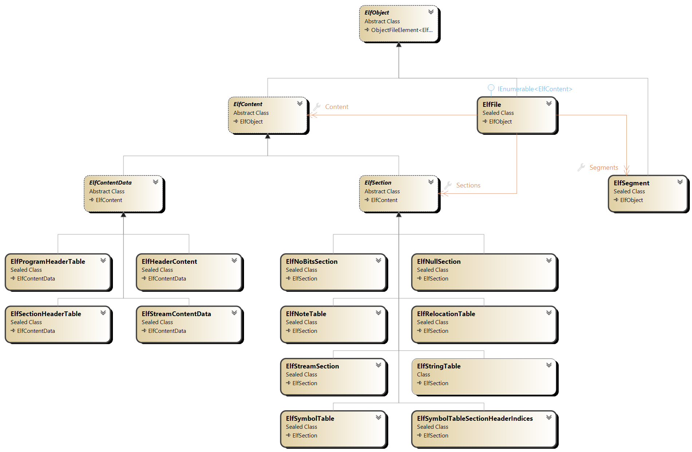
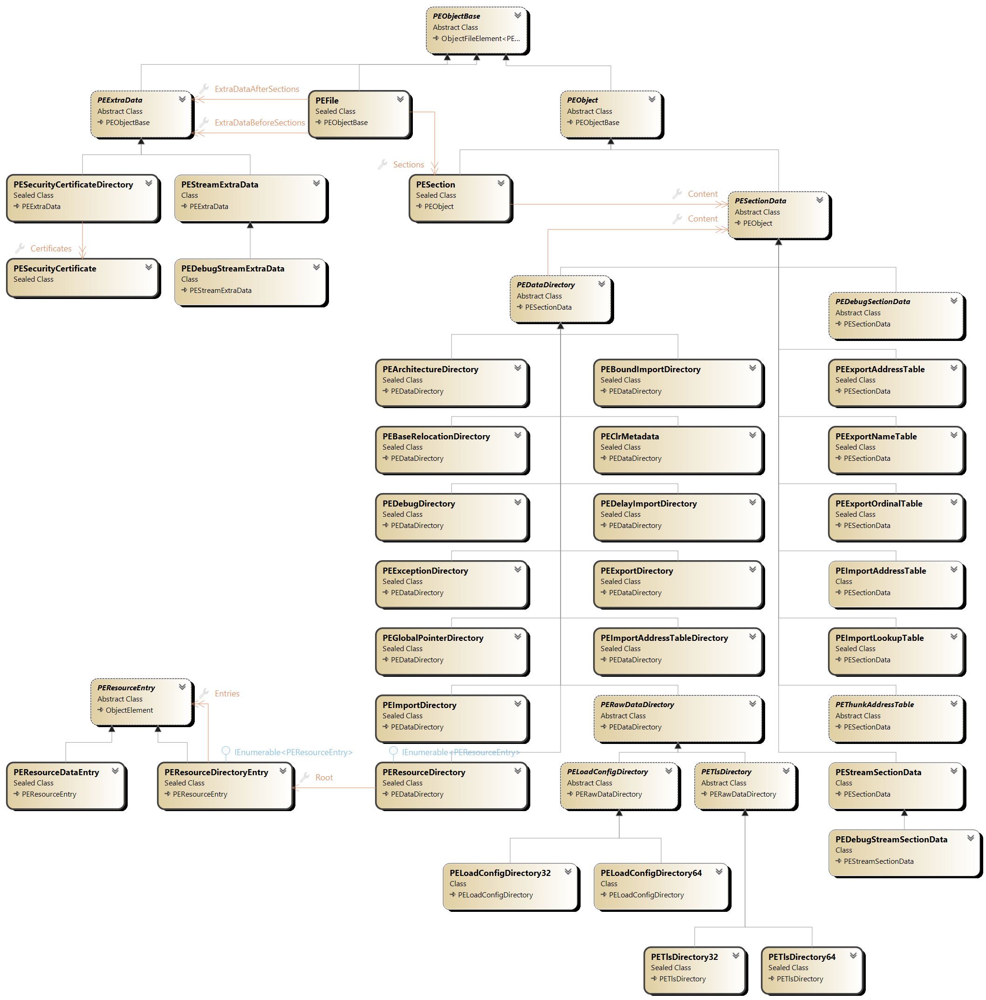

# LibObjectFile User Manual

This is the manual of LibObjectFile with the following API covered:

- [ELF Object File Format](#elf-object-file-format) via the `ElfFile` API
- [Archive ar File Format](#archive-ar-file-format) via the `ArArchiveFile` API
- [PE File Format](#pe-object-file-format) via the `PEFile` API

## ELF Object File Format

### Overview

The main entry-point for reading/writing ELF Object file is the [`ElfFile`](https://github.com/xoofx/LibObjectFile/blob/master/src/LibObjectFile/Elf/ElfFile.cs) class.

This class is the equivalent of the ELF Header and contains also sections and segments (program headers)



### ELF Reading

The ELF API allows to read from a `System.IO.Stream` via the method `ElfFile.Read`:

```C#
ElfFile elf = ElfFile.Read(inputStream);
``` 

### ELF Writing

You can create an ELF object in memory and save it to the disk:

```c#
var elf = new ElfFile();

var codeStream = new MemoryStream();
codeStream.Write(Encoding.UTF8.GetBytes("This is a text"));
codeStream.Position = 0;

// Create a .text code section
var codeSection = new ElfCustomSection(codeStream).ConfigureAs(ElfSectionSpecialType.Text);
elf.Add(codeSection);

// Always required if sections are added
elf.Add(new ElfSectionHeaderStringTable());

// Always required if sections are added
elf.Add(new ElfSectionHeaderTable());

using var outputStream = File.OpenWrite("test.out");
elf.Write(outputStream);
```

### Advanced

#### Print

You can print an object to a similar textual format than `readelf` by using the extension method `ElfFile.Print(TextWriter)`:

```c#
// Using the previous code to create an ELF with a code section
elf.Print(Console.Out);
```

will print the following output:

``` 
ELF Header:
  Magic:   7f 45 4c 46 02 01 01 00 00 00 00 00 00 00 00 00 
  Class:                             ELF64
  Data:                              2's complement, little endian
  Version:                           1 (current)
  OS/ABI:                            UNIX - System V
  ABI Version:                       0
  Type:                              REL (Relocatable file)
  Machine:                           Advanced Micro Devices X86-64
  Version:                           0x1
  Entry point address:               0x0
  Start of program headers:          0 (bytes into file)
  Start of section headers:          0 (bytes into file)
  Flags:                             0x0
  Size of this header:               0 (bytes)
  Size of program headers:           0 (bytes)
  Number of program headers:         0
  Size of section headers:           0 (bytes)
  Number of section headers:         3
  Section header string table index: 2

Section Headers:
  [Nr] Name              Type            Address          Off    Size   ES Flg Lk Inf Al
  [ 0]                   NULL            0000000000000000 000000 000000 00      0   0  0
  [ 1] .text             PROGBITS        0000000000000000 000000 00000e 00  AX  0   0  0
  [ 2] .shstrtab         STRTAB          0000000000000000 000000 000001 00      0   0  0
Key to Flags:
  W (write), A (alloc), X (execute), M (merge), S (strings), I (info),
  L (link order), O (extra OS processing required), G (group), T (TLS),
  C (compressed), x (unknown), o (OS specific), E (exclude),
  l (large), p (processor specific)

There are no section groups in this file.

There are no program headers in this file.

There is no dynamic section in this file.

There are no relocations in this file.

The decoding of unwind sections for machine type Advanced Micro Devices X86-64 is not currently supported.

No version information found in this file.
```

The `Print` is trying to follow `readelf` from as compiled on `Ubuntu 18.04`. It is not intended to be 100% exact but is currently used in the unit tests to match the output of `readelf`.

#### Section Header String Table

When sections are added to an `ElfFile.Sections`, it is required to store their names in a Section Header String Table (`.shstrtab`)

In that case, you need to add explicitly an `ElfSectionHeaderStringTable` to the sections:

```C#
// Always required if sections are added
elf.Add(new ElfSectionHeaderStringTable());
```

This section can be put at any places in the sections, but is usually put at the end.

#### Shadow sections

There is a type of section called `ElfShadowSection` which are only valid at runtime but are not saved in the Section Header Table, while their content might be saved as part of the layout of the file. They are also not part of ELF specifications but are an implementation details.

A shadow section is used by an `ElfSegment` for which a region of data might not be associated with an existing section. In that case, you still want to associate data with the segment.

This is specially required when working with executable that don't have any sections but have only segments/program headers. In that case, `ElfFile.Read` will create `ElfCustomShadowSection` for each part of the file that are being referenced by an `ElfSegment`.

#### Null section and Program Header Table

The null section `ElfNullSection` must be put as the first section of an `ElfFile`. It is the default when creating an `ElfFile`.

The Program Header Table is implemented as the `ElfProgramHeaderTable` shadow section and is added right after the `NullSection`. This is required because a segment of type `PHDR` will reference it while it is not an actual section in the original ELF file.

#### ELF Layout

An `ElfFile` represents an ELF Object File in memory that can be freely modified. Unlike its serialized version on the disk, the offsets and size of the sections and segments references can be changed dynamically.

You can force the computation of the layout of an ELF object file before saving it to the disk by using the method `ElfFile.UpdateLayout`:

```C#
ElfFile elf = ...;

// Update layout (ObjectFile.Layout, all offsets of Sections and Segments)
elf.UpdateLayout();

foreach(var section in elf.Sections)
{
    // Section.Position is now calculated as it was on the disk
    Console.WriteLine($"Section {section} Offset: 0x{section.Position:x16}");
}
```

#### Diagnostics and verification

An `ElfFile` can be created in memory with an invalid configuration (e.g missing a link between a symbol table and a string table).

You can verify the validity of an `ElfFile` by calling `ElfFile.Verify`

```C#
ElfFile elf = ...;

// Verify the validity of an ElfFile instance
var diagnostics = elf.Verify();

// If we have any errors, we can iterate on diagnostic messages
if (diagnostics.HasErrors)
{
    foreach(var message in diagnostics.Messages)
    {
        Console.WriteLine(message);
    }
}
```

### Links

- [Executable and Linkable Format (ELF).pdf](http://www.skyfree.org/linux/references/ELF_Format.pdf)
- [ELF Linux man page](http://man7.org/linux/man-pages/man5/elf.5.html)

## Archive ar File Format

### Overview

LibObjectFile supports the [Unix `ar` archive file format](https://en.wikipedia.org/wiki/Ar_(Unix)) and the main entry point class is the [`ArArchiveFile`](https://github.com/xoofx/LibObjectFile/blob/master/src/LibObjectFile/Ar/ArArchiveFile.cs)  class.

This class has a similar API than ELF for reading/writing archive.


### Archive reading

The Ar API allows to read from a `System.IO.Stream` via the method `ArArchiveFile.Read` and by specifying the type of the archive to read (e.g GNU on Linux for regular `.a` files)

```C#
ArArchiveFile ar = ArArchiveFile.Read(inputStream, ArArchiveKind.GNU);
``` 

### Archive Writing

You can create an ArArchiveFile object in memory and save it to the disk:

```c#
var arFile = new ArArchiveFile();
arFile.AddFile(new ArBinaryFile()
    {
        Name = "file.txt",
        Stream = new MemoryStream(Encoding.UTF8.GetBytes("This is the content"))
    }
);
using var outputStream = File.OpenWrite("libtest.a");
arFile.Write(outputStream);
```

Although the example above is storing a text, one of the main usage of an `ar` archive is to store object-file format (e.g `ELF`)

If you want to store direct an `ElfFile` you can use the `ArElfFile` to add an ELF object-file directly to an archive.

### Symbol Table

A symbol table allows an archive to quickly expose which symbols are stored in which file within the collection of files within the `ar` archive.

You have to use the `ArSymbolTable` and add it to an `ArArchiveFile`

> Note: The `ArSymbolTable` instance must be the first entry in the `ArArchiveFile.Files` before other file entries

```c#
var arFile = new ArArchiveFile();
// Create Symbol table, added 1st to ArArchiveFile
var symbolTable = new ArSymbolTable();
arFile.AddFile(symbolTable);
// Create an ELF
var elf = new ElfFile();
// ... fill elf, add symbols
arFile.AddFile(elf);
// Add a symbol entry
symbolTable.Symbols.Add(new ArSymbol("my_symbol", elf));
``` 
### Links

- [Archive ar file format (Wikipedia)](https://en.wikipedia.org/wiki/Ar_(Unix))

## PE Object File Format

### Overview

The main entry-point for reading/writing PE file is the [`PEFile`](https://github.com/xoofx/LibObjectFile/blob/master/src/LibObjectFile/PE/PEFile.cs) class.



#### Sections and Directories

In `LibObjectFile` all the section data `PESectionData` - e.g code, data but also including PE directories - are part of either:

- a `PESection`
- some raw data before the first section via `PEFile.ExtraDataBeforeSections`
- raw data after the last section via `PEFile.ExtraDataAfterSections`

Most of the conventional data is stored in sections, including PE directories.

A PE Directory itself can contain also a collection of `PESectionData`.

If the size of a section data is modified (e.g adding elements to a directory table or modifying a stream in a `PEStreamSectionData`), it is important to call `PEFile.UpdateLayout` to update the layout of the PE file.

#### VA, RVA, RVO

In the PE file format, there are different types of addresses:

- `VA` (Virtual Address) is the address of a section in memory including the base address of the image `PEFile.OptionalHeader.ImageBase`
- `RVA` (Relative Virtual Address) is the address of a section relative to the base address of the image
  - A `RVA` can be converted to a `VA` by adding the `PEFile.OptionalHeader.ImageBase`.
- `RVO` (Relative Virtual Offset) is an offset relative to an RVA provided by section data or a section.
  - A `RVO` can be converted to a `RVA` by adding the RVA of the section data or the section.

In `LibObjectFile` links to RVA between section and section datas are done through a `IPELink` that is combining a reference to a `PEObjectBase` and a `RVO`. It means that RVA are always up to date and linked to the right section data.

### Reading a PE File

The PE API allows to read from a `System.IO.Stream` via the method `PEFile.Read`:

```csharp
PEFile pe = PEFile.Read(inputStream);
foreach(var section in pe.Sections)
{
    Console.WriteLine($"{section}");
}
```

### Writing a PE File

The PE API allows to write to a `System.IO.Stream` via the method `PEFile.Write`:

```csharp
PEFile pe = PEFile.Read(inputStream);
// Modify the PE file
// ....
pe.Write(stream);
```

### Printing a PE File

You can print a PE file to a textual by using the extension method `PEFile.Print(TextWriter)`:

```csharp
PEFile pe = PEFile.Read(inputStream);
pe.Print(Console.Out);
```

It will generate an output like this:

```
DOS Header
    Magic                      = DOS
    ByteCountOnLastPage        = 0x90
    PageCount                  = 0x3
    RelocationCount            = 0x0
    SizeOfParagraphsHeader     = 0x4
    MinExtraParagraphs         = 0x0
    MaxExtraParagraphs         = 0xFFFF
    InitialSSValue             = 0x0
    InitialSPValue             = 0xB8
    Checksum                   = 0x0
    InitialIPValue             = 0x0
    InitialCSValue             = 0x0
    FileAddressRelocationTable = 0x40
    OverlayNumber              = 0x0
    Reserved                   = 0x0, 0x0, 0x0, 0x0
    OEMIdentifier              = 0x0
    OEMInformation             = 0x0
    Reserved2                  = 0x0, 0x0, 0x0, 0x0, 0x0, 0x0, 0x0, 0x0, 0x0, 0x0
    FileAddressPEHeader        = 0xC8

DOS Stub
    DosStub                    = 64 bytes

COFF Header
    Machine                    = Amd64
    NumberOfSections           = 3
    TimeDateStamp              = 1727726362
    PointerToSymbolTable       = 0x0
    NumberOfSymbols            = 0
    SizeOfOptionalHeader       = 240
    Characteristics            = ExecutableImage, LargeAddressAware

Optional Header
    Magic                      = PE32Plus
    MajorLinkerVersion         = 14
    MinorLinkerVersion         = 41
    SizeOfCode                 = 0x200
    SizeOfInitializedData      = 0x400
    SizeOfUninitializedData    = 0x0
    AddressOfEntryPoint        = RVA = 0x1000, PEStreamSectionData { RVA = 0x1000, VirtualSize = 0x10, Position = 0x400, Size = 0x10 }, Offset = 0x0
    BaseOfCode                 = PESection { .text RVA = 0x1000, VirtualSize = 0x10, Position = 0x400, Size = 0x200, Content[1] }
    BaseOfData                 = 0x0x0
    ImageBase                  = 0x140000000
    SectionAlignment           = 0x1000
    FileAlignment              = 0x200
    MajorOperatingSystemVersion = 6
    MinorOperatingSystemVersion = 0
    MajorImageVersion          = 0
    MinorImageVersion          = 0
    MajorSubsystemVersion      = 6
    MinorSubsystemVersion      = 0
    Win32VersionValue          = 0x0
    SizeOfImage                = 0x4000
    SizeOfHeaders              = 0x400
    CheckSum                   = 0x0
    Subsystem                  = WindowsCui
    DllCharacteristics         = HighEntropyVirtualAddressSpace, DynamicBase, TerminalServerAware
    SizeOfStackReserve         = 0x100000
    SizeOfStackCommit          = 0x1000
    SizeOfHeapReserve          = 0x100000
    SizeOfHeapCommit           = 0x1000
    LoaderFlags                = 0x0
    NumberOfRvaAndSizes        = 0x10

Data Directories
    [00] = null
    [01] = PEImportDirectory                Position = 0x00000744, Size = 0x00000028, RVA = 0x00002144, VirtualSize = 0x00000028
    [02] = null
    [03] = PEExceptionDirectory             Position = 0x00000800, Size = 0x0000000C, RVA = 0x00003000, VirtualSize = 0x0000000C
    [04] = null
    [05] = null
    [06] = PEDebugDirectory                 Position = 0x00000610, Size = 0x00000038, RVA = 0x00002010, VirtualSize = 0x00000038
    [07] = null
    [08] = null
    [09] = null
    [10] = null
    [11] = null
    [12] = PEImportAddressTableDirectory    Position = 0x00000600, Size = 0x00000010, RVA = 0x00002000, VirtualSize = 0x00000010
    [13] = null
    [14] = null
    [15] = null

Section Headers
    [00]    .text PESection                        Position = 0x00000400, Size = 0x00000200, RVA = 0x00001000, VirtualSize = 0x00000010, Characteristics = 0x60000020 (ContainsCode, MemExecute, MemRead)
    [01]   .rdata PESection                        Position = 0x00000600, Size = 0x00000200, RVA = 0x00002000, VirtualSize = 0x0000019C, Characteristics = 0x40000040 (ContainsInitializedData, MemRead)
    [02]   .pdata PESection                        Position = 0x00000800, Size = 0x00000200, RVA = 0x00003000, VirtualSize = 0x0000000C, Characteristics = 0x40000040 (ContainsInitializedData, MemRead)

Sections
    --------------------------------------------------------------------------------------------------------------------------------------------------------------------------------------------------------------------------------
    [00]    .text PESection                        Position = 0x00000400, Size = 0x00000200, RVA = 0x00001000, VirtualSize = 0x00000010, Characteristics = 0x60000020 (ContainsCode, MemExecute, MemRead)
    
        [00] PEStreamSectionData              Position = 0x00000400, Size = 0x00000010, RVA = 0x00001000, VirtualSize = 0x00000010
        
    --------------------------------------------------------------------------------------------------------------------------------------------------------------------------------------------------------------------------------
    [01]   .rdata PESection                        Position = 0x00000600, Size = 0x00000200, RVA = 0x00002000, VirtualSize = 0x0000019C, Characteristics = 0x40000040 (ContainsInitializedData, MemRead)
    
        [00] PEImportAddressTableDirectory    Position = 0x00000600, Size = 0x00000010, RVA = 0x00002000, VirtualSize = 0x00000010
            [00] PEImportAddressTable             Position = 0x00000600, Size = 0x00000010, RVA = 0x00002000, VirtualSize = 0x00000010
                [0] PEImportHintName { Hint = 376, Name = ExitProcess } (RVA = 0x2180, PEStreamSectionData { RVA = 0x2180, VirtualSize = 0x1C, Position = 0x780, Size = 0x1C }, Offset = 0x0)
            
        
        [01] PEDebugDirectory                 Position = 0x00000610, Size = 0x00000038, RVA = 0x00002010, VirtualSize = 0x00000038
            [0] Type = POGO, Characteristics = 0x0, Version = 0.0, TimeStamp = 0x66FB031A, Data = RVA = 0x00002060 (PEDebugStreamSectionData[3] -> .rdata)
            [1] Type = ILTCG, Characteristics = 0x0, Version = 0.0, TimeStamp = 0x66FB031A, Data = null
        
        [02] PEStreamSectionData              Position = 0x00000648, Size = 0x00000018, RVA = 0x00002048, VirtualSize = 0x00000018
        
        [03] PEDebugStreamSectionData         Position = 0x00000660, Size = 0x000000DC, RVA = 0x00002060, VirtualSize = 0x000000DC
        
        [04] PEStreamSectionData              Position = 0x0000073C, Size = 0x00000008, RVA = 0x0000213C, VirtualSize = 0x00000008
        
        [05] PEImportDirectory                Position = 0x00000744, Size = 0x00000028, RVA = 0x00002144, VirtualSize = 0x00000028
            [0] ImportDllNameLink = KERNEL32.dll (RVA = 0x218E, PEStreamSectionData { RVA = 0x2180, VirtualSize = 0x1C, Position = 0x780, Size = 0x1C }, Offset = 0xE)
            [0] ImportAddressTable = RVA = 0x00002000 (PEImportAddressTable[0] -> PEImportAddressTableDirectory[0] -> .rdata)
            [0] ImportLookupTable = RVA = 0x00002170 (PEImportLookupTable[7] -> .rdata)
            
        
        [06] PEStreamSectionData              Position = 0x0000076C, Size = 0x00000004, RVA = 0x0000216C, VirtualSize = 0x00000004
        
        [07] PEImportLookupTable              Position = 0x00000770, Size = 0x00000010, RVA = 0x00002170, VirtualSize = 0x00000010
            [0] PEImportHintName { Hint = 376, Name = ExitProcess } (RVA = 0x2180, PEStreamSectionData { RVA = 0x2180, VirtualSize = 0x1C, Position = 0x780, Size = 0x1C }, Offset = 0x0)
        
        [08] PEStreamSectionData              Position = 0x00000780, Size = 0x0000001C, RVA = 0x00002180, VirtualSize = 0x0000001C
        
    --------------------------------------------------------------------------------------------------------------------------------------------------------------------------------------------------------------------------------
    [02]   .pdata PESection                        Position = 0x00000800, Size = 0x00000200, RVA = 0x00003000, VirtualSize = 0x0000000C, Characteristics = 0x40000040 (ContainsInitializedData, MemRead)
    
        [00] PEExceptionDirectory             Position = 0x00000800, Size = 0x0000000C, RVA = 0x00003000, VirtualSize = 0x0000000C
            [0] Begin = RVA = 0x1000, PEStreamSectionData { RVA = 0x1000, VirtualSize = 0x10, Position = 0x400, Size = 0x10 }, Offset = 0x0
            [0] End = RVA = 0x1010, PEStreamSectionData { RVA = 0x1000, VirtualSize = 0x10, Position = 0x400, Size = 0x10 }, Offset = 0x10
            [0] UnwindInfoAddress = RVA = 0x213C, PEStreamSectionData { RVA = 0x213C, VirtualSize = 0x8, Position = 0x73C, Size = 0x8 }, Offset = 0x0     
```

### Creating a PE File

The PE format is complex and requires a lot of information to be created. 

While LibObjectFile provides a way to create a PE file from scratch, it is not easy to create a working exe/dll file. If you are trying to create a file from scratch, use the `PEFile.Print` on existing exe/dll files to understand the structure and how to create a similar file.

The following example is a complete example that creates a PE file with a code section that calls `ExitProcess` from `KERNEL32.DLL` with the value `156`:

```csharp
var pe = new PEFile();

// ***************************************************************************
// Code section
// ***************************************************************************
var codeSection = pe.AddSection(PESectionName.Text, 0x1000);
var streamCode = new PEStreamSectionData();

streamCode.Stream.Write([
    // SUB RSP, 0x28
    0x48, 0x83, 0xEC, 0x28,
    // MOV ECX, 0x9C
    0xB9, 0x9C, 0x00, 0x00, 0x00,
    // CALL ExitProcess (CALL [RIP + 0xFF1])  
    0xFF, 0x15, 0xF1, 0x0F, 0x00, 0x00,
    // INT3
    0xCC
]);

codeSection.Content.Add(streamCode);

// ***************************************************************************
// Data section
// ***************************************************************************
var dataSection = pe.AddSection(PESectionName.RData, 0x2000);

var streamData = new PEStreamSectionData();
var kernelName = streamData.WriteAsciiString("KERNEL32.DLL");
var exitProcessFunction = streamData.WriteHintName(new(0x178, "ExitProcess"));

// PEImportAddressTableDirectory comes first, it is referenced by the RIP + 0xFF1, first address being ExitProcess
var peImportAddressTable = new PEImportAddressTable()
{
    exitProcessFunction
};
var iatDirectory = new PEImportAddressTableDirectory()
{
    peImportAddressTable
};

var peImportLookupTable = new PEImportLookupTable()
{
    exitProcessFunction
};

var importDirectory = new PEImportDirectory()
{
    Entries =
    {
        new PEImportDirectoryEntry(kernelName, peImportAddressTable, peImportLookupTable)
    }
};

// Layout of the data section
dataSection.Content.Add(iatDirectory);
dataSection.Content.Add(peImportLookupTable);
dataSection.Content.Add(importDirectory);
dataSection.Content.Add(streamData);

// ***************************************************************************
// Optional Header
// ***************************************************************************
pe.OptionalHeader.AddressOfEntryPoint = new(streamCode, 0);
pe.OptionalHeader.BaseOfCode = codeSection;

// ***************************************************************************
// Write the PE to a file
// ***************************************************************************
var output = new MemoryStream();
pe.Write(output, new() { EnableStackTrace = true });
output.Position = 0;

var sourceFile = Path.Combine(AppContext.BaseDirectory, "PE", "RawNativeConsoleWin64_Generated.exe");
File.WriteAllBytes(sourceFile, output.ToArray());

// Check the generated exe
var process = Process.Start(sourceFile);
process.WaitForExit();
Assert.AreEqual(156, process.ExitCode);
```

> Notice that the code above doesn't have to setup the `PEFile.Directories` explicitly.
>
> In fact when writing a PE file, the `PEFile.Write` method will automatically populate the directories based on the content of the sections.

### Links

- [PE and COFF Specification](https://docs.microsoft.com/en-us/windows/win32/debug/pe-format)
